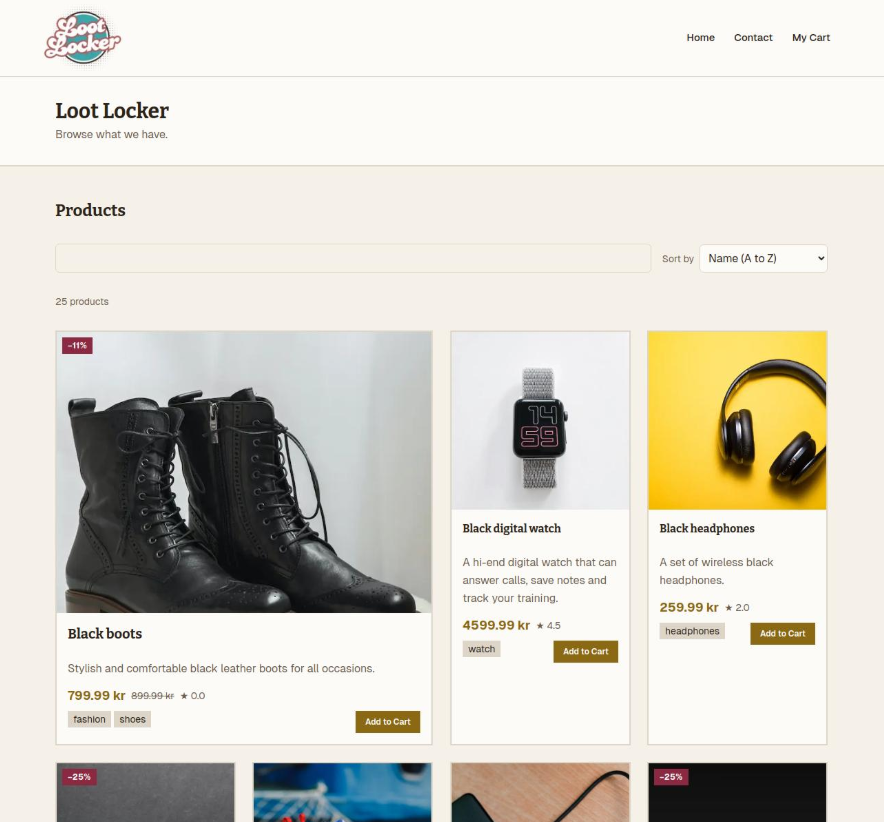

# Loot Locker



A small storefront built for a JavaScript frameworks assignment.

A small storefront built for a JavaScript frameworks assignment. It pulls products from the Noroff public API, lets people browse and sort them, add items to a cart, and walk through a simple “checkout” that ends on a thank-you page. There’s also a contact form with client-side validation—handy for demonstrating form handling without wiring up a real mail server.

If you’re grading this or just trying to run it locally, everything you need should be below.

## What’s in the box

- **Home** — Product grid fed by `GET /online-shop`, with search (including a shortcut to surface discounted items when you type things like “sale” or “discount”), plus sorting by name, price, rating, and discount.
- **Product pages** — Dynamic routes under `/product/[id]` with images (via `next/image`), optional reviews, tags, and sale pricing when the API provides a `discountedPrice`.
- **Cart** — Client-side cart with quantities, line totals, savings when something’s on sale, and persistence in `localStorage` so a refresh doesn’t wipe the basket.
- **Checkout** — The checkout button goes to `/checkout/success`, which shows a confirmation and clears the cart. There’s no payment provider; it’s a deliberate flow for the assignment.
- **Contact** — Full name, subject, email, and message with validation rules in `app/services/contactValidation.ts`, plus a short success modal when the form passes validation.

The UI uses a custom theme in `app/globals.css` (CSS variables), **Geist** and **Bitter** from `next/font`, and **Tailwind CSS v4** for layout and utilities. The header includes a responsive menu, skip link, and cart badge.

## Tech stack

| Piece        | Notes                                      |
| ------------ | ------------------------------------------ |
| Next.js 16   | App Router, server components where it fits |
| React 19     | Client components for interactivity        |
| TypeScript   | Strict mode                                |
| Tailwind CSS 4 | PostCSS pipeline                         |
| ESLint       | `eslint-config-next` (core-web-vitals + TypeScript) |

Product fetches use React `cache()` and Next’s `fetch` with a **60 second** revalidation window (`app/api/api.ts`).

## Prerequisites

- **Node.js** — A current LTS version (e.g. 20.x or 22.x) is a safe bet.
- **npm** — Comes with Node; this repo uses `package-lock.json`.

## Getting started

```bash
git clone <your-repo-url>
cd jsfw-2025-v1-mia-js-frameworks
npm install
npm run dev
```

Then open [http://localhost:3000](http://localhost:3000). Use `npm run build` and `npm run start` when you want to check the production build.

## Scripts

| Command       | Purpose                |
| ------------- | ---------------------- |
| `npm run dev` | Dev server (Next.js)   |
| `npm run build` | Production build     |
| `npm run start` | Run production server |
| `npm run lint`  | ESLint                 |

## Environment variables

All of these are optional. If you skip them, the app falls back to sensible defaults (see `app/api/api.ts` and `app/layout.tsx`).

| Variable              | Purpose |
| --------------------- | ------- |
| `NEXT_PUBLIC_API_URL` | Base URL for the Noroff API (default: `https://v2.api.noroff.dev`) |
| `NEXT_PUBLIC_SITE_URL` | Canonical site URL for metadata (`metadataBase`; default points at a Netlify-style deploy) |

Create a `.env.local` in the project root if you need to override them (see Next.js docs for loading order).

## Project layout (short tour)

- `app/` — Routes, layouts, global styles, and React contexts (`Cart`, `Toast`).
- `app/api/api.ts` — Noroff shop fetch helpers (`GET /online-shop` and `/online-shop/:id`).
- `app/components/shared/` — Types, pricing/format helpers, site copy, and shared UI class strings.
- `app/services/` — Contact form validation.
- `public/` — Static assets served from `/`.

Remote product images are allowed for `**.noroff.dev` in `next.config.ts`.

## API

Product data comes from the **Noroff v2 API** (`/online-shop` and `/online-shop/:id`). If the home page can’t load products, the user sees a friendly message; 404 on a product detail page uses Next’s `notFound()` where appropriate.

---

If something doesn’t run as expected, double-check Node version and that nothing else is bound to port 3000. Pull requests or issues—use whatever workflow your course uses.
